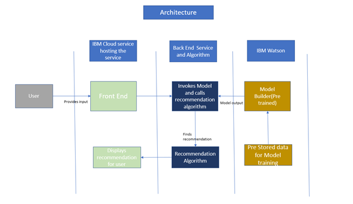
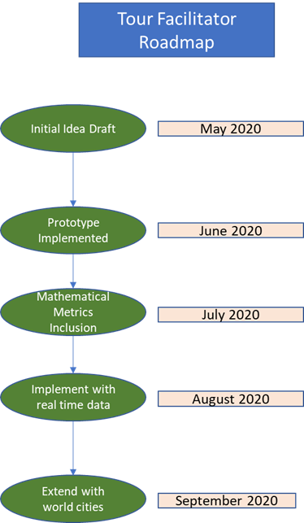

# Tour-Facilitator

Want the best city to go as a tourist or make your new base? This solution deals with ranking the cities primarily on environmental factors. With enviromental changes and increasing tourism pressure, many famous tourist places are facing climatic changes and their common environmental trait is not same as known to people. This creates a demand for projecting a true real time scenario to travellers of the weather condition at their time of visit.

## Contents
1. [Short description](#short-description)
1. [Demo video](#demo-video)
1. [The architecture](#the-architecture)
1. [Long description](#long-description)
1. [Project roadmap](#project-roadmap)
1. [Live demo](#live-demo)
1. [Built with](#built-with)
1. [Versioning](#versioning)
1. [Authors](#authors)

##	Short description

Very often market targets the trip only from point of view of scenic location and demand of the place. However, for many amateur traveller, climatic factor is very important parameter for travelling which is very much individual’s choice (due to experience he wants and health factor). With ever changing climatic condition, cities experience dynamic weather condition every year due to global warming and other factors, making the decision no more a thumb of rule. In order to help travellers to plan their trip based on their preference of environment the “tour facilitator” is what is our solution.
User inputs the parameter of interest i.e temperature, wind speed, altitude, rainfall and month of travel planned. The system will provide him list of cities matching his preference with ranking.

##	Demo video

 

## The architecture

 

##	Long description
One of the major reasons, why people travel is to experience various climatic and environmental factors absent in their region. For example, people living in plains wants to experience the snow and cool winters of hills. How often one’s trip turn out to be disappointing because the real environmental condition of place at the tour time is not what is expected? Very often one lands into the hill with full sunny day and on beach with rainfall. With climatic change some areas have experienced non consistent climatic scenario and hardly any tour and operators pay attention to this aspect/priority of travellers. Tourism is one important aspect of life with most individual doing atleast one trip in a year. One important concern of people is when to visit which place. In general, we don’t have such a service to recommend things based on environmental preference of people and its services basically recommends the tours based on “famous reliable” place. But today some environmental factors are as important as sightseeing for people touring. 

Most of trip helping services doesn’t takes in account the indepth requirement of the tourist about environmental condition, even if they cover it, just briefly touches upon them at higher level (cold places or beaches). If one plans to schedule the trips in advance there are no service to dynamically suggest/recommend a period of time or place based on his preference owing to climatic change occurring. With large availability of historic environmental data and ability to process them, using them for recommendation is quite feasible

Implementation:
User ML Model Recommendation Algorithm Steps
1.	Gives input by interacting with front end. Communicates with the ML model and gets the trained data for data input by user.	A pre trained Machine Learning model which gives output based on parameters passed.
2.	Prepares a ranking based on Model output.	
3.	Displays the output given by recommendation algorithm.		

##	Project roadmap

##	Live demo
You can find a running system to test at https://tour-facilitator.eu-gb.mybluemix.net/

##	Built with
*	[IBM Cloud](cloud.ibm.com)  - The cloud service hosting the front end.
*	[IBM Watson Studio](https://cloud.ibm.com/catalog/services/watson-studio) - The Machine Learning model.
*	[Python code](https://www.python.org/) – Implements the recommendation algorithm.
*	[HTML/CSS](https://html.spec.whatwg.org/multipage/) –  For creating the Front end.

##	Versioning
1.0.1 

##	Authors
*	Raghav Gupta
*	Abhinav Gupta

